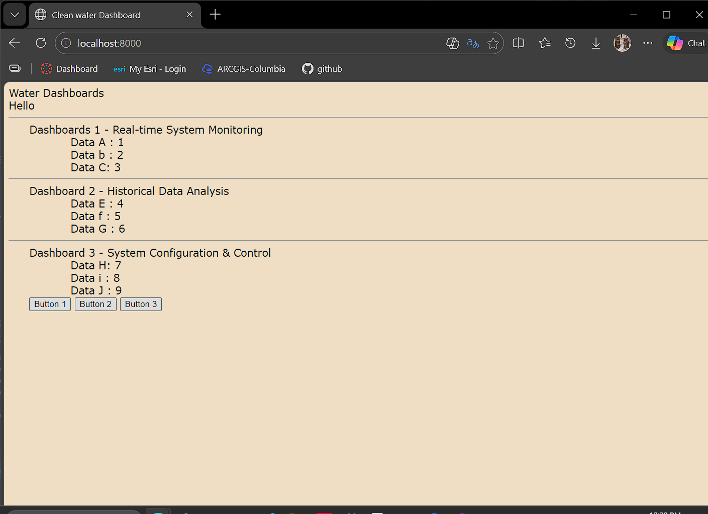
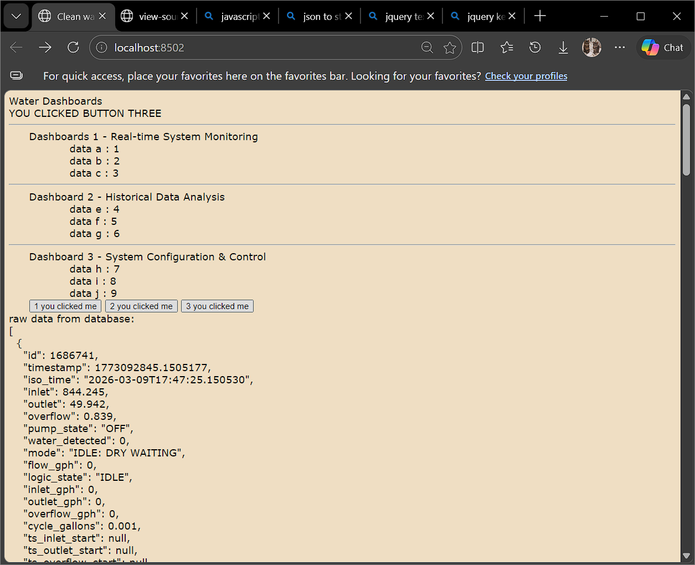

# fog-dashboard Readme
## water!

windows box: 

to start up local server:   
`$ python3 -m http.server`  
page is served at localhost:8000 

got data! march-13-26

hosted dashboard page:
https://michelle-phung-cu.github.io/foggy-dash-public-123/
